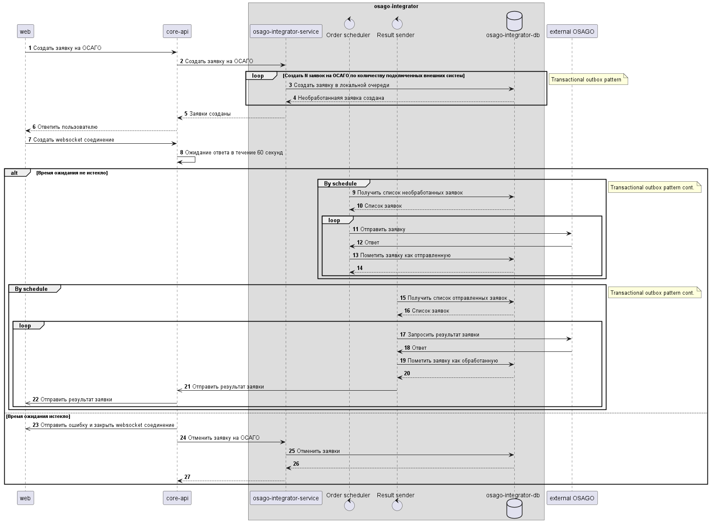

# Задание 4. Проектирование продажи ОСАГО
## Ограничения и предположения

## Предложения по изменению архитектуры
Измененная архитектура представлена на листе "Exc4 - Updated InsureTech"

### osago-aggregator
1. Реализовать взаимодействие core-app с osago-aggregator с использованием асинхронного подхода
2. При реализации osago-aggregator использовать паттерны Transactional Outbox, Timer
3. При реализации работы с osago-aggregator на стороне core-app для ограничения нагрузки osago-aggregator использовать паттерн Rate Limiter
4. Для повышения отказоустойчивости и повышения производительности при взаимодействии osago-aggregator и внешними системами использовать паттерн Circuit Braker
5. Общая схема работы osago-aggregator приведена на sequence диаграмме 
